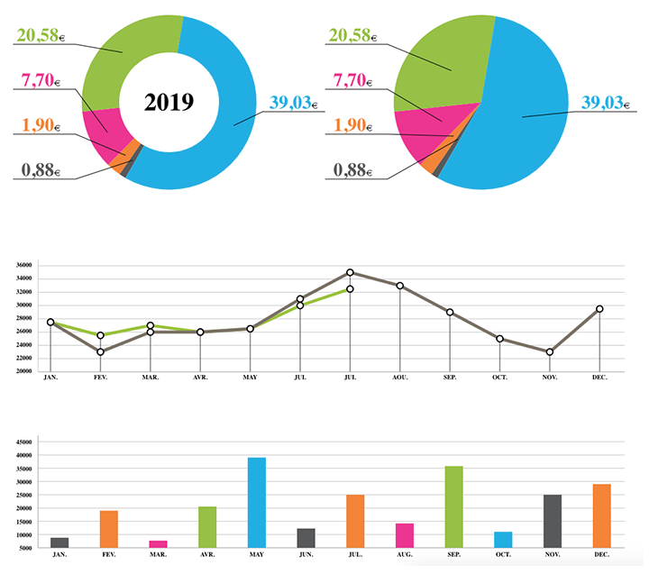

# SVG Chart



## Symfony requirement

* [meyfa/php-svg](https://packagist.org/packages/meyfa/php-svg)

## Pie/Donut chart

### Example

```php
use Cws\Bundle\SVGChartBundle\SVGChart\SVGChart;

$conf = json_decode(file_get_contents('pie_chart_data.json'));

$response = new Response(
    SVGChart::createPie(
        $conf->data,
        $conf->styles
    )
);

$response->headers->set('Content-Type', 'image/svg+xml');

return $response;
```

### Configuration

Inside the `pie_chart_data.json` file:

```js
{
    "data": [
        // Only the first element will be processed (one pie/donut per chart)
        {
            "values": [
                {
                    "value" : 0.88,
                    "color" : "#58595b",
                    "label" : "0,88<span>€</span>",
                    "id"    : "arc-1"
                },
                ...
            ]
        }
    ],
    "styles": {
        "center" : {
            "x"              : 250,
            "y"              : 180
        },

        // Display of the labels
        "legend" : {
            "labelCssClass"  : "label label-slice",
            "textHeight"     : 30,
            "textMaxWidth"   : 100,

            // Optional
            "textTemplate"   : "<div {{ATTR}}>{{TEXT}}</div>",

            // Line between the legend and the donut slice
            "hasLine"        : true,
            "lineColor"      : "#000000",
            "lineCssClass"   : "legend-line",

            // Only used on pie mode.
            // Position of the start of the legend line between the border and the center of the chart in percent (value between 0 and 1)
            "lineOffset"     : 0.75
        },

        // Only used on donut mode
        // Legend in the center of the donut
        "donutMainLegend" : {
            "label"         : "2015",
            "cssClass"      : "main-legend"
        },

        // There are 2 display mode: pie and donut
        "mode"               : "donut",

        // External radius
        "radius"             : 140,
        // Starting angle
        "angleOffset"        : 120,

        //Size of the SVG element
        "width"              : 500,
        "height"             : 360,

        "cssClass"           : "pie-chart",
        "cssSliceClass"      : "slice",

        // Only used on donut mode
        "donutThickness"     : 60
    }
}
```


## Lines chart

### Example

```php
use Cws\Bundle\SVGChartBundle\SVGChart\SVGChart;

$conf = json_decode(file_get_contents('lines_chart_data.json'));

$response = new Response(
    SVGChart::createLines(
        $conf->data,
        $conf->styles
    )
);

$response->headers->set('Content-Type', 'image/svg+xml');

return $response;
```

### Configuration

Inside the `lines_chart_data.json` file:

```js
{
    "data": [
        // All elements will be processed (several lines on the same chart)
        {
            // Line properties
            "color"              : "#9bc340",
            "thickness"          : 5,
            "id"                 : "line-1",
            "cssClass"           : "line",

            // Bullets properties (circle placed on each point of the line)
            "displayBullets"     : true,

            // If displayBullets is false, you don't need the following properties
            "bulletColor"        : "#ffffff",
            "bulletRadius"       : 5,
            "bulletStroke"       : "#000",
            "bulletStrokeWidth"  : 2,
            "baseBulletId"       : "line-1-bullet",
            "cssBulletClass"     : "bullet",
            "cssBulletListClass" : "bullets",

            // All value of the lines
            "values" : [
                {
                    "value" : 27500,
                    "label" : "27 500"
                },
                ...
            ]
        },

        // Other lines
        ...
    ],
    "styles": {
        // Display of the abscissa and ordinate line
        "axes" : {
            "abs" : {
                "color"           : "#9b9b9b",
                "thickness"       : 1,
                "isDisplayed"     : true,
                "wrapperCssClass" : "labels-abs",
                "labelCssClass"   : "label label-abs",
                "labels" : [
                    {
                        "label" : "Jan."
                    },
                    {
                        "label" : "Feb."
                    },
                    ...
                ]

            },
            "ord" : {
                "color"           : "#c5c5c5",
                "thickness"       : 1,
                "isDisplayed"     : true,
                "wrapperCssClass" : "labels-ord",
                "labelCssClass"   : "label label-ord",
                // Offset between the top of the ordinate line and the first line of the grid
                "marginY"         : 10,
                "min"             : 20000,
                "max"             : 36000,
                "step"            : 2000
            }
        },

        // Display of the grid behind the chart
        "grid" : {
            "horizontal" : {
                "color"       : "#c5c5c5",
                "isDisplayed" : true,
                "thickness"   : 1
            },
            "vertical" : {
                "color"       : "#323232",
                "isDisplayed" : true,
                "thickness"   : 1
            }
        },

        // Size and position of the chart inside the SVG element
        "canvas" : {
            // Margin between the ordinate line and the first point of the lines.
            // Same margin between the last point of the lines and the right side of the chart
            "marginX" : 20,
            "top"     : 80,
            "left"    : 60,
            "width"   : 1000,
            "height"  : 170
        },

        // Size of the SVG element
        "width"    : 1000,
        "height"   : 280,

        "cssClass" : "lines-chart",
        "linecap"  : "round",
        "linejoin" : "round"
    }
}
```


## Bars chart

### Example

```php
use Cws\Bundle\SVGChartBundle\SVGChart\SVGChart;

$conf = json_decode(file_get_contents('bars_chart_data.json'));

$response = new Response(
    SVGChart::createBars(
        $conf->data,
        $conf->styles
    )
);

$response->headers->set('Content-Type', 'image/svg+xml');

return $response;
```

### Configuration

Inside the `bars_chart_data.json` file:

```js
{
    "data": [
        // Only the first element will be processed (one set of bar per chart)
        {
            "values": [
                {
                    "value"  : 8800,
                    "label"  : "8 800<span>€</span>",
                    "color"  : "#58595b",
                    "stroke" : "none",
                    "id"     : "bar-1"
                },
                ...
            ]
        }
    ],
    "styles": {
        // Display of the abscissa and ordinate line
        "axes" : {
            "abs" : {
                "color"           : "#9b9b9b",
                "thickness"       : 1,
                "isDisplayed"     : true,
                "wrapperCssClass" : "labels-abs",
                "labelCssClass"   : "label label-abs",

                // If null, the width of the bars will be computed using the width of the chart canvas (see canvas properties below). Otherwise, the size is in px
                "barWidth"        : null,
                // Size between bars in px
                "barGap"          : 50,

                "labels" : [
                    {
                        "label" : "Jan."
                    },
                    {
                        "label" : "Feb."
                    },
                    ...
                ]

            },
            "ord" : {
                "color"           : "#9b9b9b",
                "thickness"       : 1,
                "isDisplayed"     : true,
                "wrapperCssClass" : "labels-ord",
                "labelCssClass"   : "label label-ord",
                // Offset between the top of the ordinate line and the first line of the grid
                "marginY"         : 10,
                "min"             : 5000,
                "max"             : 45000,
                "step"            : 5000
            }
        },

        // Display of the horizontal lines behind the bars
        "grid" : {
            "horizontal" : {
                "color"       : "#c5c5c5",
                "isDisplayed" : true,
                "thickness"   : 1
            }
        },

        // Size and position of the chart inside the SVG element
        "canvas" : {
            // Margin between the ordinate line and the first point of the lines.
            // Same margin between the last point of the lines and the right side of the chart
            "marginX" : 20,
            "top"     : 80,
            "left"    : 60,
            "width"   : 940,
            "height"  : 170
        },

        // Size of the SVG element
        "height"      : 360,
        "width"       : 1000,

        "cssClass"    : "bars-chart",

        // Properties of each bar
        "cssBarClass" : "bar",
        // stroke
        "linecap"     : "square",
        "linejoin"    : "square",
        "thickness"   : 1
    }
}
```
